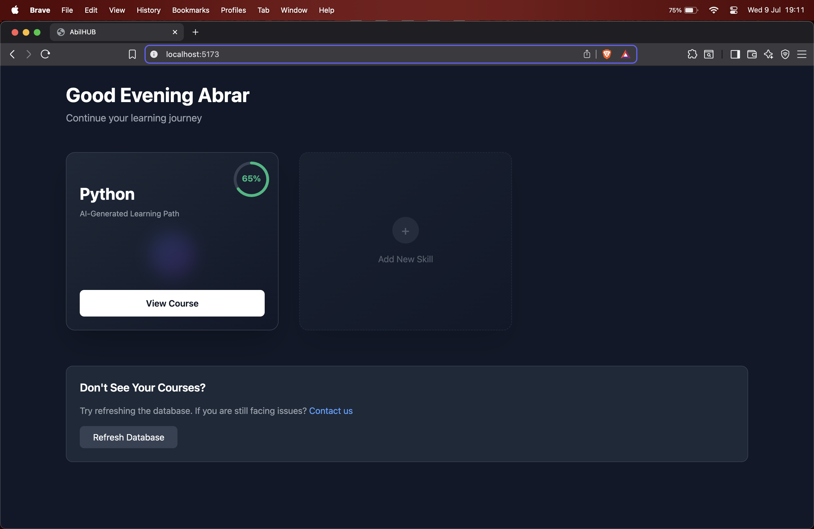

# AbliHUB 🧠🚀

**AbliHUB** is an AI-powered project-based learning platform that helps learners choose a skill, generate a personalized roadmap, build mini-projects, and get instant feedback — all in one place.

## 🌟 Features

- 🎯 **SkillCard**: Choose a skill like Web Dev, Data Science, ML, etc.
- 🗺️ **AI Roadmap Generator**: Generates a step-by-step roadmap based on your selected skill and current level.
- 🛠️ **Mini Project Creator**: Creates mini-projects based on your roadmap progress.
- 🤖 **AI Feedback System**: Upload your code/project and get instant feedback.
- 📊 **Progress Dashboard**: Visual dashboard to track learning and project completion.

## 📸 Preview

> 🚧 This is the Week 1 UI prototype. Backend and AI features coming soon!
> 

## 🧰 Tech Stack

- ⚛️ React + Vite
- 🧠 OpenAI API (for project/roadmap/feedback generation)
- 🔐 Firebase or Auth.js (for auth) _(planned)_
- 🗂️ MongoDB or Supabase (for backend data) _(planned)_
- 🎨 Tailwind CSS (for UI design)

## 📦 Installation

````bash
# Clone the repository
git clone https://github.com/yourusername/ablihub.git

# Go into the project directory
cd ablihub

# Install dependencies
npm install

# Start the development server
npm run dev```
````
